# AI_BOT — College AI Chatbot with 3D Talking Avatar

## Full Project Report

---

**Project Title:** AI_BOT — College AI Chatbot with 3D Talking Avatar

**Student Name:** Rajput Virendra sinh Narpat sinh

**Enrollment No:** 221250107042

**College:** Shree Swaminarayan Institute of Technology (SSIT), Bhat

**Internal Guide:** Dr. Darshan Patel

**Academic Year:** 2025–2026

---

## Table of Contents

1. [Abstract](#1-abstract)
2. [Introduction](#2-introduction)
3. [Literature Survey](#3-literature-survey)
4. [System Analysis](#4-system-analysis)
5. [Technology Stack (Verified from Source Code)](#5-technology-stack-verified-from-source-code)
6. [System Design & Architecture](#6-system-design--architecture)
7. [Module Description](#7-module-description)
8. [Database Design](#8-database-design)
9. [Implementation Details](#9-implementation-details)
10. [API Endpoints](#10-api-endpoints)
11. [Testing](#11-testing)
12. [Screenshots & User Interface](#12-screenshots--user-interface)
13. [Limitations & Known Issues](#13-limitations--known-issues)
14. [Future Scope & Enhancements](#14-future-scope--enhancements)
15. [Conclusion](#15-conclusion)
16. [References](#16-references)

---

## 1. Abstract

**AI_BOT** is a full-stack web-based College AI Chatbot developed specifically for **Shree Swaminarayan Institute of Technology (SSIT), Bhat**. The system uses **Retrieval-Augmented Generation (RAG)** to answer college-specific queries by searching through a pre-built knowledge base of SSIT FAQ data. For general queries, it leverages the **Groq Cloud API** (running the **Llama 3.1-8B-Instant** model) to provide intelligent responses. The chatbot features a **3D talking avatar** rendered using **Three.js** and the **TalkingHead** library, with **lip-sync animation** and **browser-native text-to-speech** output. Users can also **upload PDF documents** and ask context-aware questions about them. The system supports **voice input** through the browser's Web Speech API, making it accessible and interactive.

The **frontend** is built with **React 19** using **Vite 6** as the build tool, styled with **Tailwind CSS 4**, and uses **React Router DOM 7** for client-side navigation. The **backend** is powered by **Node.js** with **Express 4** (ESM modules), uses **MongoDB Atlas** (via **Mongoose 8**) for data persistence, and invokes **Python FAISS scripts** via child process spawning for vector similarity search. Text embeddings are generated locally in Node.js using the **Xenova Transformers** library with the **all-MiniLM-L6-v2** model.

---

## 2. Introduction

### 2.1 Background

Educational institutions increasingly require automated systems to handle student queries about admissions, courses, fees, campus facilities, and academic processes. Traditional FAQ pages are static and do not provide a conversational experience. There is a growing need for intelligent chatbot systems that can understand natural language questions and provide accurate, context-aware answers.

### 2.2 Problem Statement

Students and prospective applicants of SSIT frequently have questions about admission procedures, fee structures, available courses, campus facilities, hostel availability, scholarship options, and placement opportunities. Answering these queries manually is time-consuming and not scalable. There is no existing intelligent system that can:

1. Answer college-specific questions accurately using a curated knowledge base.
2. Handle general knowledge queries using a large language model (LLM).
3. Allow users to upload PDF documents and ask questions about their content.
4. Provide a visually engaging experience with a 3D animated avatar.
5. Accept voice input for hands-free interaction.

### 2.3 Objective

The objective of this project is to design and develop a **College AI Chatbot** that:

- Uses **Retrieval-Augmented Generation (RAG)** to answer college-specific questions from a curated SSIT FAQ knowledge base.
- Falls back to **Groq Cloud LLM (Llama 3.1-8B-Instant)** for general queries.
- Allows users to **upload PDF documents** and ask context-aware questions about them.
- Provides a **3D talking avatar** with lip-sync animation for an engaging visual experience.
- Supports **voice input** via the Web Speech API.
- Stores **chat history** in MongoDB for persistence and retrieval.

### 2.4 Scope of the Project

The scope of this project covers:

- **Frontend**: A single-page application (SPA) built with React, providing the chat interface, PDF upload, voice input, and 3D avatar display.
- **Backend**: A RESTful API server built with Express.js, handling question answering, PDF processing, embedding generation, vector search, and chat persistence.
- **AI/ML Pipeline**: Local text embedding generation, FAISS-based vector similarity search (via Python), and LLM-based response generation via Groq API.
- **Database**: MongoDB Atlas for storing PDF metadata and chat history.
- **3D Avatar**: A Ready Player Me avatar model rendered with Three.js and TalkingHead, embedded in an iframe.

---

## 3. Literature Survey

### 3.1 Chatbot Technologies

Chatbots have evolved from simple rule-based systems (pattern matching, decision trees) to AI-powered conversational agents using natural language processing (NLP) and large language models (LLMs). Modern chatbots leverage transformer-based architectures like GPT, Llama, and Gemini for understanding and generating human-like responses.

### 3.2 Retrieval-Augmented Generation (RAG)

RAG is a technique that combines **information retrieval** with **text generation**. Instead of relying solely on an LLM's parametric knowledge, RAG first retrieves relevant documents or passages from a knowledge base, then feeds them as context to the LLM for generating accurate, grounded answers. This approach significantly reduces hallucination and improves factual accuracy for domain-specific queries.

**How RAG is used in this project:**

1. The user's query is converted to a **384-dimensional embedding vector** using the `all-MiniLM-L6-v2` model.
2. The embedding is compared against pre-computed embeddings of SSIT FAQ data using **FAISS (Facebook AI Similarity Search)**.
3. The top-3 most similar FAQ entries are retrieved as context.
4. The context and the original question are sent to the **Groq LLM** to generate a final, contextually accurate answer.

### 3.3 Vector Similarity Search (FAISS)

FAISS (Facebook AI Similarity Search) is an open-source library developed by Meta AI for efficient similarity search and clustering of dense vectors. It supports fast nearest-neighbor search over millions of vectors. In this project, FAISS is used via Python scripts invoked from the Node.js backend to perform L2 (Euclidean distance) similarity search over FAQ and PDF embeddings.

### 3.4 Text Embeddings

Text embeddings are dense vector representations of text that capture semantic meaning. The `all-MiniLM-L6-v2` model (from the Sentence-Transformers family) produces 384-dimensional embeddings and is widely used for semantic search tasks due to its balance of speed and accuracy. In this project, embeddings are generated locally in Node.js using the `@xenova/transformers` library, eliminating the need for external embedding API calls.

### 3.5 3D Avatars and Lip-Sync

The TalkingHead library (by met4citizen) enables the rendering and animation of 3D humanoid avatars using Three.js. It supports lip-sync animation synchronized with text-to-speech audio, providing a visually engaging conversational experience. The avatar model is created using Ready Player Me, which generates `.glb` format 3D models.

### 3.6 Existing Systems Comparison

| Feature | Traditional FAQ Page | Generic Chatbot (e.g., Dialogflow) | **AI_BOT (This Project)** |
|---|---|---|---|
| Natural Language Understanding | ❌ No | ✅ Yes | ✅ Yes |
| College-Specific Knowledge | ✅ Static | ⚠️ Requires manual intents | ✅ RAG-based automatic |
| PDF Q&A | ❌ No | ❌ No | ✅ Yes |
| 3D Avatar | ❌ No | ❌ No | ✅ Yes |
| Voice Input | ❌ No | ⚠️ Limited | ✅ Yes |
| Chat History Persistence | ❌ No | ⚠️ Platform-dependent | ✅ MongoDB |

---

## 4. System Analysis

### 4.1 Existing System

Prior to this project, SSIT did not have an intelligent automated question-answering system. Students relied on:

- **Static FAQ web pages** that required manual searching.
- **Phone calls and in-person visits** to the admission office.
- **Email correspondence** with response delays.

**Drawbacks of the existing system:**

- No natural language understanding — students must find the exact FAQ entry.
- No support for document-based queries.
- No visual or voice-based interaction.
- Not available 24/7.

### 4.2 Proposed System

The AI_BOT system addresses all the above drawbacks by providing:

- **Intelligent Q&A**: Natural language queries answered using RAG + LLM.
- **PDF Q&A**: Upload any PDF and ask questions about its content.
- **3D Avatar**: A visually engaging animated avatar that speaks the answers.
- **Voice Input**: Hands-free interaction using the browser's SpeechRecognition API.
- **Chat History**: Persistent storage of all conversations for review.
- **24/7 Availability**: Always-on web-based system, accessible from any device with a browser.

### 4.3 Functional Requirements

| # | Requirement | Description |
|---|---|---|
| FR-1 | General Question Answering | User can type a question and receive an AI-generated answer. |
| FR-2 | College-Specific Query Handling | College-related queries are answered using RAG over SSIT FAQ data. |
| FR-3 | PDF Upload | User can upload PDF documents for context-aware Q&A. |
| FR-4 | PDF Question Answering | User can ask questions about uploaded PDFs. |
| FR-5 | Voice Input | User can speak their question using the microphone. |
| FR-6 | 3D Avatar Display | A 3D animated avatar is displayed and lip-syncs responses. |
| FR-7 | Text-to-Speech Output | The avatar speaks the AI's response aloud. |
| FR-8 | Chat History | All conversations are saved and can be reviewed later. |
| FR-9 | New Chat | User can start a new conversation at any time. |
| FR-10 | Save Chat | User can manually save the current conversation. |

### 4.4 Non-Functional Requirements

| # | Requirement | Description |
|---|---|---|
| NFR-1 | Performance | Responses should be generated within 5–10 seconds. |
| NFR-2 | Usability | The UI should be intuitive and accessible. |
| NFR-3 | Scalability | The backend should handle multiple concurrent users. |
| NFR-4 | Security | API keys should be stored in environment variables. |
| NFR-5 | Reliability | The system should gracefully handle errors and fallback. |

### 4.5 Feasibility Study

| Feasibility Type | Analysis |
|---|---|
| **Technical** | All required technologies (React, Node.js, MongoDB, FAISS, Groq API, Three.js) are mature and well-documented. |
| **Operational** | The system is web-based and accessible from any modern browser without requiring additional software installation. |
| **Economic** | The project uses free/open-source libraries. Groq API provides a generous free tier. MongoDB Atlas has a free cluster tier. |
| **Schedule** | The project is implementable within one academic semester. |

---

## 5. Technology Stack (Verified from Source Code)

> [!IMPORTANT]
> Every technology, library, and version listed below has been **verified directly from the project's source code**, including `package.json`, `.env`, import statements, and runtime configuration files. This corrects inaccuracies that may exist in the README or other documentation.

### 5.1 Frontend Technologies

| Technology | Version | Purpose | Verified From |
|---|---|---|---|
| **React** | 19.0.0 | UI component library (SPA) | `ai-bot-frontend/package.json` |
| **Vite** | 6.3.1 | Build tool and dev server | `ai-bot-frontend/package.json` |
| **Tailwind CSS** | 4.1.4 | Utility-first CSS framework | `ai-bot-frontend/package.json` |
| **React Router DOM** | 7.5.1 | Client-side routing | `ai-bot-frontend/package.json` |
| **Three.js** | 0.176.0 | 3D rendering engine (for avatar) | `ai-bot-frontend/package.json` |
| **Axios** | 1.8.4 | HTTP client for API calls | `ai-bot-frontend/package.json` |
| **TalkingHead** | 1.4 (CDN) | 3D avatar with lip-sync | `avatar.html` importmap (CDN) |
| **Web Speech API** | Browser-native | Voice input (SpeechRecognition) | `VoiceInput.jsx` |
| **SpeechSynthesis API** | Browser-native | Text-to-speech for avatar speech | `avatar.html` `browserSpeak()` |
| **ESLint** | 9.22.0 | Code linting | `ai-bot-frontend/package.json` |
| **@vitejs/plugin-react** | 4.3.4 | React support for Vite | `ai-bot-frontend/package.json` |

### 5.2 Backend Technologies

| Technology | Version | Purpose | Verified From |
|---|---|---|---|
| **Node.js** | — | Server runtime (ESM mode) | `package.json` `"type": "module"` |
| **Express** | 4.21.2 | Web framework (REST API) | `Backend/package.json` |
| **Mongoose** | 8.13.2 | MongoDB ODM | `Backend/package.json` |
| **MongoDB** (Driver) | 7.1.1 | MongoDB native driver | `Backend/package.json` |
| **Multer** | 1.4.5-lts.1 | File upload handling (PDF) | `Backend/package.json` |
| **pdfjs-dist** | 2.14.305 | PDF text extraction | `Backend/package.json` |
| **dotenv** | 16.4.7 | Environment variable management | `Backend/package.json` |
| **CORS** | 2.8.5 | Cross-origin resource sharing | `Backend/package.json` |
| **UUID** | 11.1.0 | Unique ID generation | `Backend/package.json` |
| **Nodemon** | 3.1.9 | Dev server auto-restart | `Backend/package.json` |

### 5.3 AI/ML Technologies

| Technology | Version | Purpose | Verified From |
|---|---|---|---|
| **Groq Cloud API** (via OpenAI SDK) | — | LLM inference (Llama 3.1-8B-Instant) | `aiUtils.js` → `baseURL: "https://api.groq.com/openai/v1"` |
| **OpenAI SDK** | 4.86.1 | Client SDK to call Groq API | `Backend/package.json`, `aiUtils.js` |
| **@xenova/transformers** | 2.17.2 | Local text embedding (all-MiniLM-L6-v2) | `Backend/package.json`, `embeddingUtils.js` |
| **FAISS** (Python) | — | Vector similarity search (L2) | `search_faiss.py`, `search_pdf_faiss.py` |
| **NumPy** (Python) | — | Numerical array operations | `search_faiss.py`, `search_pdf_faiss.py` |

> [!WARNING]
> **Critical Correction:** The function is named `getGeminiResponse()` in the code, but it actually calls the **Groq API** (not Google Gemini). The `.env` file contains `GROQ_API_KEY` and `aiUtils.js` connects to `https://api.groq.com/openai/v1` using the **OpenAI SDK** with the **Llama 3.1-8B-Instant** model. The function name is a legacy artifact from a previous implementation.

### 5.4 Database

| Technology | Provider | Purpose | Verified From |
|---|---|---|---|
| **MongoDB Atlas** | Cloud (MongoDB Inc.) | Stores PDF metadata and chat history | `.env` → `MONGO_URI=mongodb://...orgwj0p.mongodb.net...` |

### 5.5 3D Avatar & Speech

| Technology | Source | Purpose | Verified From |
|---|---|---|---|
| **TalkingHead Library** | CDN (v1.4) | 3D avatar rendering + lip-sync | `avatar.html` importmap |
| **Three.js** | CDN (v0.170.0 in avatar.html) | 3D rendering engine | `avatar.html` importmap |
| **Ready Player Me** | `.glb` model file | 3D humanoid avatar model | `avatar.html` → `/models/brunette (1).glb` |
| **Browser SpeechSynthesis** | Browser-native | Voice output (en-GB) | `avatar.html` → `browserSpeak()` function |
| **Google Cloud TTS API** | REST API (client-side) | Fallback TTS (when avatar iframe not ready) | `googleTTS.js` → `eu-texttospeech.googleapis.com` |

### 5.6 Deployment Configuration

| Technology | Purpose | Verified From |
|---|---|---|
| **Vercel** | Backend deployment config | `Backend/vercel.json` |

### 5.7 Installed but Unused Dependencies

> [!NOTE]
> The following packages are listed in `Backend/package.json` but are **not imported or used** in any source file. They are likely remnants from earlier development iterations.

| Package | Version | Probable Original Intent |
|---|---|---|
| `@google/generative-ai` | 0.22.0 | Was likely used for Google Gemini before switching to Groq |
| `@pinecone-database/pinecone` | 5.1.1 | Was likely used for cloud vector DB before switching to local FAISS |
| `langchain` | 0.3.24 | Was likely used for LLM chaining before custom implementation |
| `weaviate-ts-client` | 2.2.0 | Alternative vector DB client, never used |
| `google-auth-library` | 9.15.1 | Was likely for Google API authentication |
| `google-tts-api` | 2.0.2 | Was likely for server-side TTS, not currently used on backend |
| `canvas` | 3.1.0 | Was likely for image processing, not used |
| `pdf-lib` | 1.17.1 | Alternative PDF library, not used (pdfjs-dist is used instead) |
| `pdf-parse` | 1.1.1 | Alternative PDF parser, not used (pdfjs-dist is used instead) |
| `axios` | 1.8.1 | Not used in backend code (frontend has its own axios) |

---

## 6. System Design & Architecture

### 6.1 System Architecture Diagram

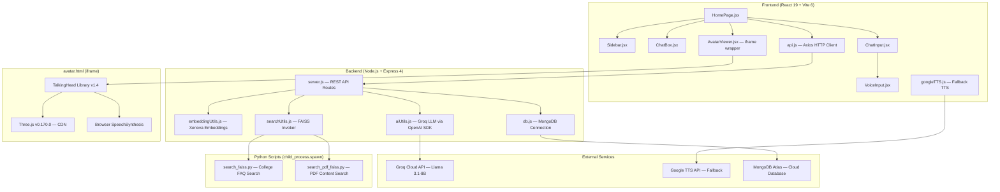

### 6.2 Data Flow Diagram (DFD) — Level 0

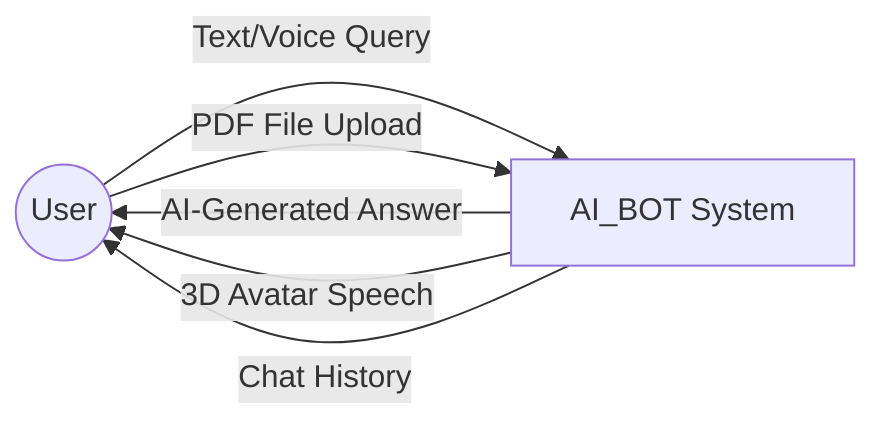

### 6.3 Data Flow Diagram — Level 1

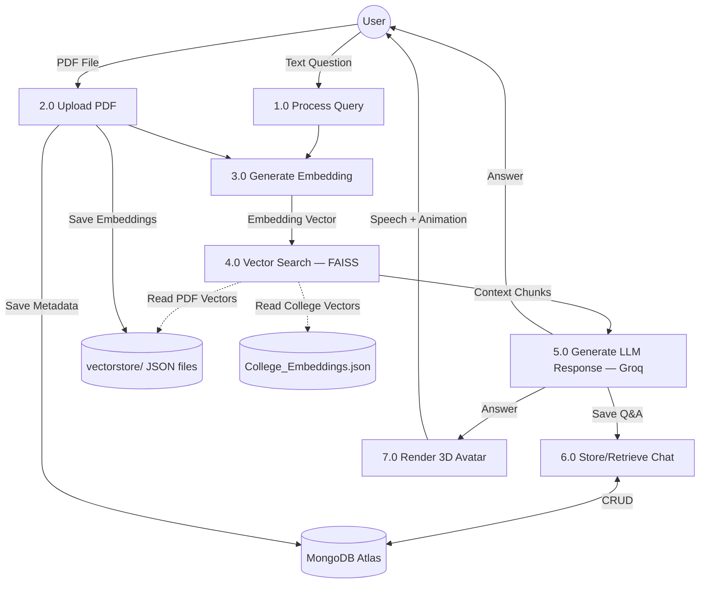

### 6.4 Use Case Diagram

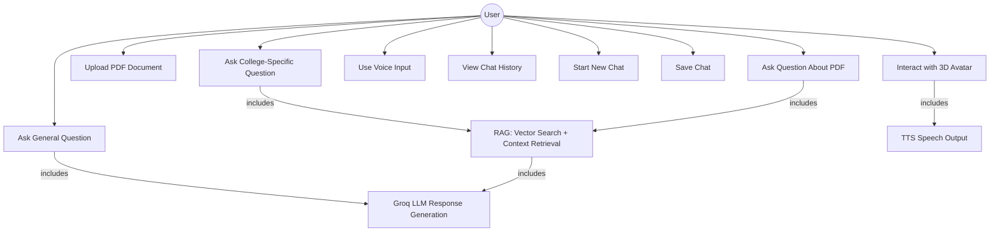

---

## 7. Module Description

### 7.1 Module Overview

The AI_BOT project is organized into the following major modules:

```
AI_BOT/
├── Backend/                  ← Node.js + Express REST API
│   ├── server.js             ← Main server with all route handlers
│   ├── db.js                 ← MongoDB connection manager
│   ├── models/pdf.js         ← Mongoose schemas (PDF, PDFChat)
│   ├── utils/
│   │   ├── aiUtils.js        ← Groq LLM API wrapper
│   │   ├── embeddingUtils.js ← Xenova embedding + college query detection
│   │   └── searchUtils.js    ← FAISS search via Python child process
│   ├── search_faiss.py       ← Python: FAISS search for college FAQ
│   ├── search_pdf_faiss.py   ← Python: FAISS search for PDF content
│   ├── upload-college-data.js← One-time script: embed college FAQ data
│   ├── College_Data/         ← SSIT FAQ JSON + pre-computed embeddings
│   ├── vectorstore/          ← Per-PDF embedding JSON files
│   └── uploads/              ← Uploaded PDF files (Multer destination)
│
└── ai-bot-frontend/          ← React 19 + Vite 6 SPA
    ├── src/
    │   ├── App.jsx            ← Router with single route (/)
    │   ├── main.jsx           ← React entry point
    │   ├── index.css          ← Tailwind CSS + global styles
    │   ├── pages/
    │   │   └── HomePage.jsx   ← Main page: orchestrates all features
    │   ├── components/
    │   │   ├── Sidebar.jsx    ← Chat history sidebar
    │   │   ├── ChatBox.jsx    ← Message display area
    │   │   ├── ChatInput.jsx  ← Text input + file upload + voice
    │   │   ├── VoiceInput.jsx ← Speech recognition component
    │   │   └── AvatarViewer.jsx ← iframe wrapper for 3D avatar
    │   ├── api/api.js         ← All backend API calls (Axios)
    │   └── utils/googleTTS.js ← Google TTS fallback client
    └── public/
        ├── avatar.html        ← TalkingHead 3D avatar page (iframe)
        └── models/            ← .glb avatar model files
```

---

### 7.2 Module 1: Question Answering Engine (Backend)

**Files:** `server.js` (route `/ask`), `embeddingUtils.js`, `searchUtils.js`, `aiUtils.js`

**Workflow:**

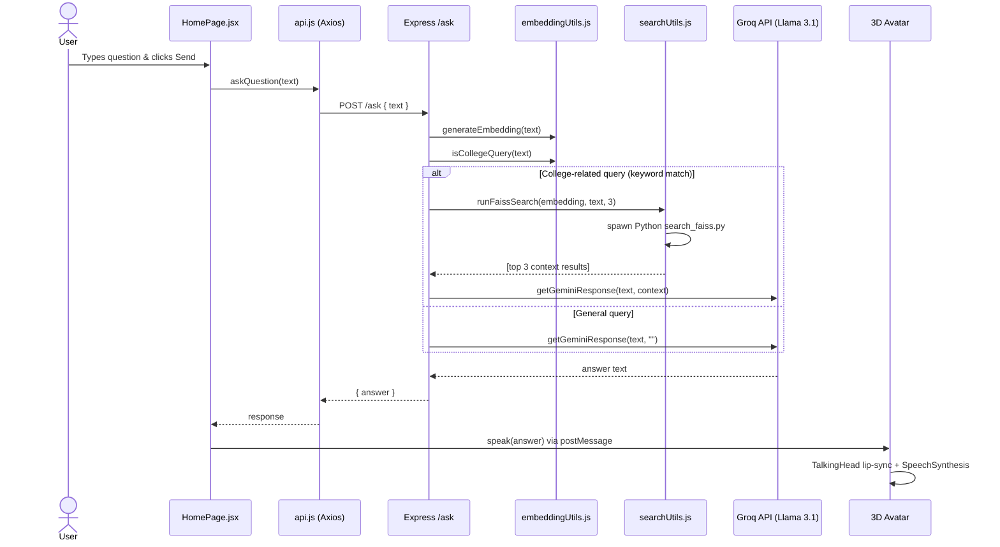

**Key Implementation Details:**

1. **College Query Detection** (`isCollegeQuery()`): Uses simple **keyword matching** on the input text. Keywords include: `college`, `university`, `campus`, `admissions`, `courses`, `degree`, `faculty`, `history`. If any keyword is found (case-insensitive), the query is classified as college-related.

2. **Embedding Generation** (`generateEmbedding()`): Uses `@xenova/transformers` to load the `Xenova/all-MiniLM-L6-v2` model locally in Node.js. The model is loaded once (cached) and produces a 384-dimensional float32 vector for any input text. Mean pooling and L2 normalization are applied.

3. **FAISS Vector Search** (`runFaissSearch()`): The Node.js backend **spawns a Python child process** (`search_faiss.py`) passing the query embedding as a JSON string via command-line arguments. The Python script loads `College_Data/College_Embeddings.json`, builds an in-memory FAISS `IndexFlatL2` index, searches for the top-3 nearest neighbors, and prints the results as JSON to stdout.

4. **LLM Response Generation** (`getGeminiResponse()`): Despite the function name, this calls the **Groq Cloud API** at `https://api.groq.com/openai/v1` using the **OpenAI SDK** (`openai` npm package). The model used is `llama-3.1-8b-instant` (configurable via `GROQ_MODEL` environment variable). The prompt includes a system message ("You are a helpful college assistant for SSIT") and the user's question with optional context from RAG.

---

### 7.3 Module 2: PDF Upload & Q&A (Backend)

**Files:** `server.js` (routes `/upload-pdf`, `/ask-pdf`), `search_pdf_faiss.py`

**PDF Upload Workflow:**

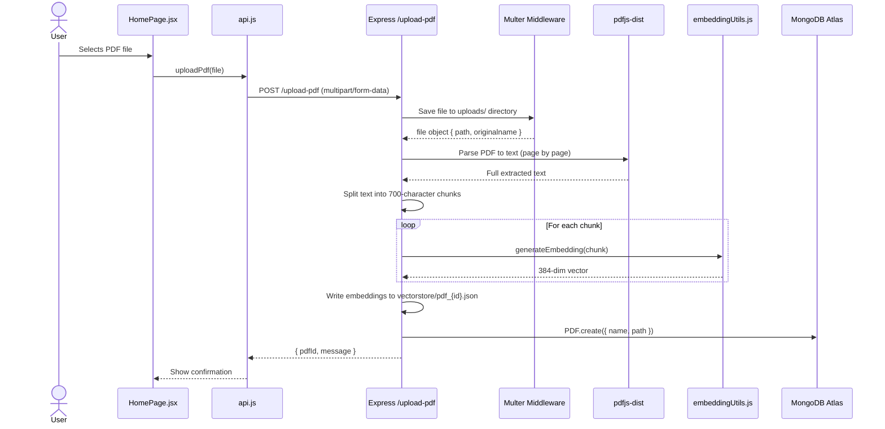

**PDF Q&A Workflow:**

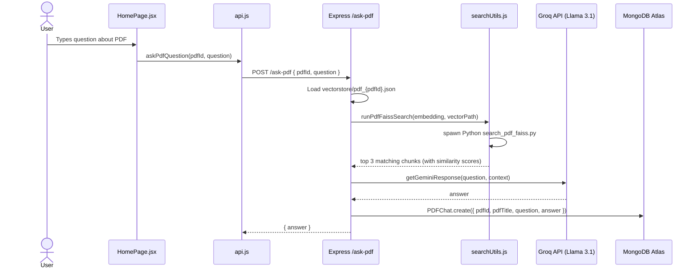

**Key Details:**
- PDF text extraction uses `pdfjs-dist` (v2.14.305), the same engine used by Firefox's built-in PDF viewer.
- Text is split into **700-character chunks** using regex: `fullText.match(/(.|[\r\n]){1,700}/g)`.
- Each chunk is embedded and stored as a JSON file: `vectorstore/pdf_{mongodbObjectId}.json`.
- The PDF FAISS search script (`search_pdf_faiss.py`) returns results with similarity scores calculated as `1 / (1 + L2_distance)`.

---

### 7.4 Module 3: Voice Input (Frontend)

**File:** `VoiceInput.jsx`

**Workflow:**

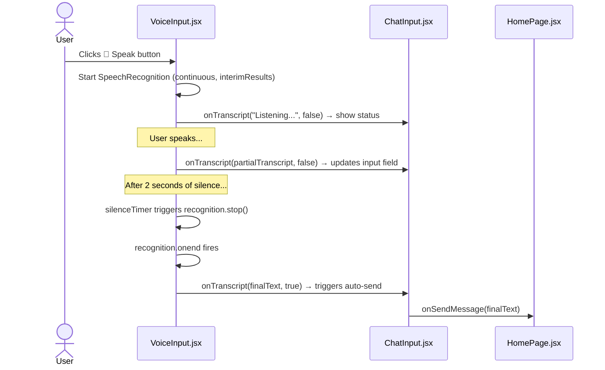

**Implementation Details:**
- Uses the browser's native **Web Speech API** (`window.webkitSpeechRecognition || window.SpeechRecognition`).
- Recognition is configured with `continuous: true` and `interimResults: true` in English (`en-US`).
- A **2-second silence detection timer** (`setTimeout`) is used to automatically stop recognition after the user stops speaking.
- The final transcript is sent with `isFinal = true`, which triggers the `ChatInput` component to call `onSendMessage()`.
- Visual feedback: The mic button turns **red** while listening, with animated **pulsing dots**. The input field shows a green pulse animation via the `voice-active-pulse` CSS class.

---

### 7.5 Module 4: 3D Avatar & Speech (Frontend)

**Files:** `AvatarViewer.jsx`, `public/avatar.html`, `googleTTS.js`

**Architecture:**

The 3D avatar runs inside an **iframe** (`avatar.html`) that is completely self-contained. Communication between the React app and the iframe happens via the **`postMessage` API**.

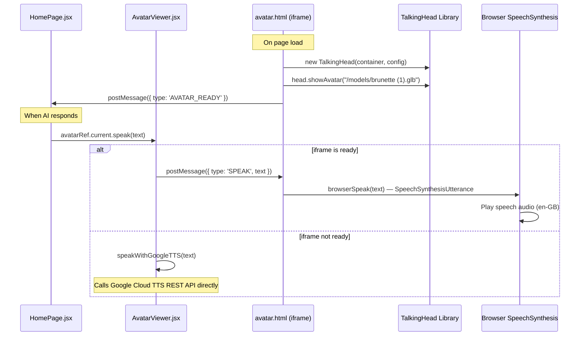

**Key Details:**
- The avatar model is a **Ready Player Me** `.glb` file (`brunette (1).glb`).
- **TalkingHead** is loaded from CDN (`cdn.jsdelivr.net/gh/met4citizen/TalkingHead@1.4`) along with **Three.js 0.170.0**.
- The avatar's speech uses **browser-native `SpeechSynthesis`** (the `browserSpeak()` function), NOT Google Cloud TTS. This is a zero-cost, zero-API-key speech method.
- **Google Cloud TTS** (`googleTTS.js`) is used as a **fallback only when the iframe is not ready**. It calls `eu-texttospeech.googleapis.com/v1beta1/text:synthesize` with a hardcoded API key (security concern).
- The avatar is configured with `cameraView: "upper"`, `lipsyncModules: ["en"]`, and `ttsLang: "en-GB"`.

---

### 7.6 Module 5: Chat History & Persistence

**Files:** `server.js` (routes `/all-chats`, `/chat-history/:pdfId`, `/save-chat`), `Sidebar.jsx`

**Workflow:**

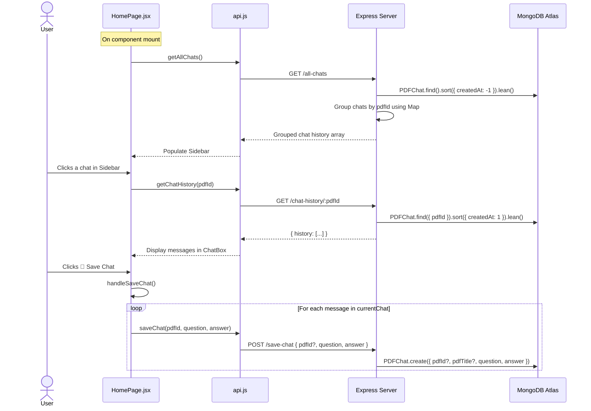

**Key Details:**
- Chat history is grouped by `pdfId` on the server side using an in-memory `Map`.
- The `/all-chats` endpoint uses Mongoose's `.lean()` for faster queries (returns plain JS objects instead of Mongoose documents).
- PDF chats are **automatically saved** after each Q&A response (in `/ask-pdf`).
- General chats (no `pdfId`) are **NOT automatically saved** — they require the user to click "Save Chat".
- The "Save Chat" button saves **all messages in the current conversation** individually, which can cause duplicates for PDF chats that were already saved.

---

### 7.7 Module 6: Frontend UI Components

#### 7.7.1 App.jsx — Application Router

```jsx
<BrowserRouter>
  <Routes>
    <Route path="/" element={<HomePage />} />
  </Routes>
</BrowserRouter>
```
Single route application. All functionality is on the root path (`/`).

#### 7.7.2 HomePage.jsx — Main Orchestrator

The main page component manages:
- **State**: `loading`, `chats`, `currentChat`, `currentPdfId`, `currentPdfTitle`
- **Ref**: `avatarRef` (to call `speak()` on the AvatarViewer)
- **Layout**: Two-column layout — Avatar (left 2/3) and Chat (right 1/3)
- **Handlers**: `handleSendMessage`, `handleFileUpload`, `handleSelectChat`, `handleNewChat`, `handleSaveChat`

#### 7.7.3 Sidebar.jsx — Chat History Panel

- Fixed-width (`w-64`) left sidebar
- Shows "New Chat" button and list of recent chats grouped by PDF
- PDF chats show a document icon (red); general chats show a chat icon (blue)
- Each item displays the PDF title and first 40 characters of the first question

#### 7.7.4 ChatBox.jsx — Message Display

- Shows user messages (blue bubble) and AI responses (gray bubble)
- Auto-scrolls to bottom on new messages using `useRef` + `scrollIntoView`
- Shows a loading animation ("AI is thinking...") with bouncing dots
- Empty state shows an SVG icon with "No messages yet" message

#### 7.7.5 ChatInput.jsx — Input Area

- Text input field with placeholder that changes based on whether a PDF is selected
- File upload button (hidden `<input type="file" accept=".pdf">` triggered by label)
- Send button
- VoiceInput component integration
- Visual pulse animation when voice is active

#### 7.7.6 VoiceInput.jsx — Voice Recognition

- Toggle button (green = idle, red = listening)
- Uses `useRef` for recognition instance and silence timer (avoids stale closure issues)
- 2-second silence auto-send

---

## 8. Database Design

### 8.1 Database: MongoDB Atlas

**Connection String:** Stored in `.env` as `MONGO_URI`

**Cluster:** MongoDB Atlas (Replica Set: `atlas-xk7fa1-shard-0`) with 3 shards

**Connection Configuration:**
```javascript
mongoose.connect(MONGO_URI, {
    serverSelectionTimeoutMS: 60000,
    socketTimeoutMS: 45000,
    connectTimeoutMS: 45000,
    maxPoolSize: 10,
    minPoolSize: 2,
    maxIdleTimeMS: 30000,
    family: 4  // IPv4 only
});
```

### 8.2 Schema Design

#### Collection: `pdfs`

| Field | Type | Constraints | Description |
|---|---|---|---|
| `_id` | ObjectId | Auto-generated | Primary key |
| `name` | String | Required | Original filename of the uploaded PDF |
| `path` | String | Required | Server file path (e.g., `uploads/abc123`) |
| `createdAt` | Date | Default: `Date.now` | Upload timestamp |

#### Collection: `pdfchats`

| Field | Type | Constraints | Description |
|---|---|---|---|
| `_id` | ObjectId | Auto-generated | Primary key |
| `pdfId` | ObjectId (ref: PDF) | Optional, Indexed | Links to the parent PDF (null for general chats) |
| `pdfTitle` | String | Optional | PDF filename for display |
| `question` | String | Required | User's question |
| `answer` | String | Required | AI-generated answer |
| `createdAt` | Date | Default: `Date.now`, Indexed | Creation timestamp |

**Indexes:**
- `pdfId` — Single-field index for filtering chats by PDF
- `createdAt` — Single-field index for sorting
- `{ pdfId: 1, createdAt: 1 }` — Compound index for efficient filtered + sorted queries

### 8.3 ER Diagram

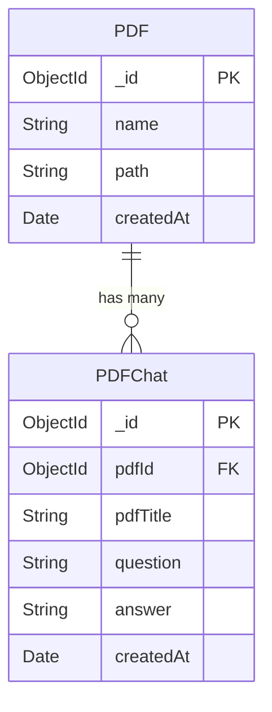

### 8.4 Data Storage: File System

In addition to MongoDB, the system uses the local file system for:

| Path | Format | Content |
|---|---|---|
| `College_Data/College_Data.json` | JSON | Raw SSIT FAQ content (9 sections) |
| `College_Data/College_Embeddings.json` | JSON | Pre-computed embeddings for FAQ entries |
| `vectorstore/pdf_{objectId}.json` | JSON | Per-PDF chunk embeddings (generated on upload) |
| `uploads/` | Binary | Raw uploaded PDF files (Multer destination) |

---

## 9. Implementation Details

### 9.1 College FAQ Knowledge Base

The SSIT FAQ knowledge base (`SSIT_FAQ_Full.json`) contains structured data about:

1. **General Admission Questions** — Courses offered (CE, CSE, IT, ME, Civil), eligibility, management quota
2. **Admission Process** — ACPC online registration, document requirements
3. **Fees & Scholarships** — Fee structure (₹67,200/year), government scholarships, MYSY
4. **Campus & Facilities** — Hostels, labs, library (10,000+ books), canteen, bus facility, sports
5. **Visitor Information** — Campus location, contact details, help desk hours
6. **Why Choose SSIT** — GTU affiliation, experienced faculty, placement cell
7. **GTU vs. Private University** — Comparison table
8. **CE vs. IT vs. CSE** — Branch comparison
9. **Extra-Curricular Activities** — Tech fest, sports, cultural events, clubs

**Embedding Process** (`upload-college-data.js`):
1. Reads `College_Data/College_Data.json`
2. For each section, composes full text from title, Q&A, points, comparisons, activities, and notes
3. Generates 384-dim embedding using Xenova/all-MiniLM-L6-v2
4. Saves embeddings with metadata (UUID, text, title, category, tags) to `College_Embeddings.json`

### 9.2 RAG Pipeline Details

```
User Query: "What courses are offered at SSIT?"
       │
       ▼
┌─────────────────────────────┐
│ Step 1: isCollegeQuery()    │
│ Keywords: "courses" → TRUE  │
└──────────────┬──────────────┘
               │
               ▼
┌─────────────────────────────┐
│ Step 2: generateEmbedding() │
│ Model: all-MiniLM-L6-v2    │
│ Output: 384-dim float32[]  │
└──────────────┬──────────────┘
               │
               ▼
┌─────────────────────────────────┐
│ Step 3: runFaissSearch()        │
│ spawn("python", [               │
│   "search_faiss.py",            │
│   JSON.stringify(embedding),    │
│   "College_Data/..Embeddings.json",│
│   "3",                          │
│   userQuery                     │
│ ])                              │
│ Output: top-3 matching FAQ chunks│
└──────────────┬──────────────────┘
               │
               ▼
┌─────────────────────────────────┐
│ Step 4: getGeminiResponse()     │
│ API: Groq (Llama 3.1-8B)       │
│ System: "SSIT college assistant"│
│ User: question + context chunks │
│ Temperature: 0.7                │
└──────────────┬──────────────────┘
               │
               ▼
        Final Answer → User
```

### 9.3 FAISS Search Implementation

**`search_faiss.py`** (College FAQ Search):
```python
import sys, json, faiss, numpy as np

query_vector = np.array(json.loads(sys.argv[1])).astype('float32').reshape(1,-1)
vector_path = sys.argv[2]

with open(vector_path, encoding='utf-8') as f:
    data = json.load(f)

dim = len(data[0]['embedding'])
index = faiss.IndexFlatL2(dim)
vectors = np.array([d['embedding'] for d in data]).astype('float32')
index.add(vectors)

distances, indices = index.search(query_vector, 3)

results = [{"text": data[i]['text']} for i in indices[0] if 0 <= i < len(data)]
print(json.dumps(results))
```

**Key characteristics:**
- Uses `IndexFlatL2` — exact brute-force L2 distance search (no approximation)
- Builds index fresh on every query (no persistent index)
- Returns top-3 results
- College search: No error handling
- PDF search (`search_pdf_faiss.py`): Has proper error handling, argument validation, and returns similarity scores

### 9.4 LLM Integration (Groq)

```javascript
// aiUtils.js — Actual implementation
const client = new OpenAI({
    apiKey: process.env.GROQ_API_KEY,
    baseURL: "https://api.groq.com/openai/v1"
});

const completion = await client.chat.completions.create({
    model: process.env.GROQ_MODEL || "llama-3.1-8b-instant",
    messages: [
        { role: "system", content: "You are a helpful college assistant for SSIT..." },
        { role: "user", content: buildPrompt(question, context) }
    ],
    temperature: 0.7
});
```

**Why Groq?**
- **Free tier** with generous rate limits
- **Extremely fast inference** (< 1 second for most queries)
- **OpenAI-compatible API** — can use the `openai` npm package directly
- **Llama 3.1-8B-Instant** — high-quality open-source model

---

## 10. API Endpoints

### 10.1 REST API Summary

| Method | Endpoint | Description | Request Body | Response |
|---|---|---|---|---|
| `GET` | `/` | Health check | — | `"Welcome to the PDF Chatbot API!"` |
| `POST` | `/ask` | Ask a general or college question | `{ text: string }` | `{ answer: string }` |
| `POST` | `/upload-pdf` | Upload a PDF for Q&A | `multipart/form-data (pdf)` | `{ pdfId: string, message: string }` |
| `POST` | `/ask-pdf` | Ask a question about a specific PDF | `{ pdfId: string, question: string }` | `{ answer: string }` |
| `GET` | `/all-chats` | Get all chat history (grouped) | — | `[{ _id: { pdfId, pdfTitle }, chats: [...] }]` |
| `GET` | `/chat-history/:pdfId` | Get chat history for a specific PDF | — | `{ history: [...] }` |
| `POST` | `/save-chat` | Save a chat entry | `{ pdfId?: string, question: string, answer: string }` | `{ message: string, success: boolean }` |

### 10.2 Server Configuration

- **Port:** 5000
- **CORS:** Open (allows all origins — `app.use(cors())`)
- **Body Parsing:** `express.json()`
- **File Upload:** Multer with `dest: "uploads/"` (no file type/size validation)

---

## 11. Testing

### 11.1 Testing Methodology

The project was tested using manual functional testing across the following test cases:

| # | Test Case | Input | Expected Output | Status |
|---|---|---|---|---|
| TC-1 | General question | "What is machine learning?" | AI-generated answer (no college context) | ✅ Pass |
| TC-2 | College-specific question | "What courses are offered at SSIT?" | Answer with SSIT course list from FAQ | ✅ Pass |
| TC-3 | PDF upload | Valid PDF file | "PDF uploaded and embedded" message | ✅ Pass |
| TC-4 | PDF Q&A | Question about uploaded PDF content | Context-aware answer | ✅ Pass |
| TC-5 | Voice input | Speak a question via microphone | Transcript appears and is auto-sent | ✅ Pass |
| TC-6 | 3D Avatar speech | Any question with answer | Avatar lip-syncs and browser speaks | ✅ Pass |
| TC-7 | Chat history retrieval | Click on a past chat in sidebar | Full conversation loaded | ✅ Pass |
| TC-8 | New chat | Click "New Chat" button | Chat cleared, no PDF selected | ✅ Pass |
| TC-9 | Save chat | Click "Save Chat" button | "Chat saved successfully" message | ✅ Pass |
| TC-10 | Empty input | Click Send with empty text | No request sent, no error | ✅ Pass |
| TC-11 | Invalid PDF | Upload non-PDF file | Error message displayed | ✅ Pass |
| TC-12 | Server offline | Ask question when backend is down | Error message in chat | ✅ Pass |

### 11.2 Browser Compatibility

| Browser | Voice Input | 3D Avatar | TTS | Overall |
|---|---|---|---|---|
| Google Chrome | ✅ | ✅ | ✅ | ✅ Fully Supported |
| Microsoft Edge | ✅ | ✅ | ✅ | ✅ Fully Supported |
| Mozilla Firefox | ❌ No SpeechRecognition | ✅ | ✅ | ⚠️ Partial |
| Safari | ⚠️ Limited | ✅ | ✅ | ⚠️ Partial |

---

## 12. Screenshots & User Interface

### 12.1 UI Layout Description

The application has a **single-page layout** with three main areas:

```
┌──────────────┬──────────────────────┬───────────────────┐
│              │                      │                   │
│   SIDEBAR    │    3D AVATAR         │   CHAT AREA       │
│   (w-64)     │    (2/3 width)       │   (1/3 width)     │
│              │                      │                   │
│  • College   │    ┌────────────┐    │  ┌─────────────┐  │
│    AI Bot    │    │            │    │  │ User: ...   │  │
│              │    │  TalkingHead│    │  │ AI: ...     │  │
│  • New Chat  │    │  Lip-sync  │    │  │             │  │
│              │    │  Avatar    │    │  │ User: ...   │  │
│  • Recent    │    │            │    │  │ AI: ...     │  │
│    Chats     │    │            │    │  │             │  │
│    - PDF 1   │    └────────────┘    │  └─────────────┘  │
│    - PDF 2   │                      │                   │
│    - General │                      │  ┌─────────────┐  │
│              │                      │  │ [Input] [📄] │  │
│  © 2026      │                      │  │ [Send] [🎤]  │  │
│              │                      │  │ [💾 Save]    │  │
└──────────────┴──────────────────────┴───────────────────┘
```

### 12.2 Component Styling

- **Color scheme:** Light mode with `bg-gray-100` background
- **Chat bubbles:** User = blue (`bg-blue-100`), AI = gray (`bg-gray-100`)
- **Buttons:** Primary = orange (`bg-orange-600`), Upload = indigo (`bg-indigo-600`), Save = green (`bg-green-600`), Voice idle = green, Voice active = red
- **Animations:** Bounce dots (loading), pulse (voice active), smooth scroll (new messages)
- **Typography:** System UI font stack (`system-ui, Avenir, Helvetica, Arial, sans-serif`)

---

## 13. Limitations & Known Issues

### 13.1 Critical Issues

| # | Issue | Impact | Files |
|---|---|---|---|
| 1 | Google Cloud TTS API key hardcoded in frontend JavaScript | Security vulnerability — key exposed in browser | `googleTTS.js`, `avatar.html` |
| 2 | General (non-PDF) chats are not auto-saved | Conversations lost on page refresh | `HomePage.jsx` |
| 3 | "Save Chat" duplicates PDF chat entries | Database grows with duplicate records | `HomePage.jsx` |
| 4 | FAISS Python dependency makes Vercel deployment non-functional | RAG and PDF Q&A features break on Vercel | `searchUtils.js`, `vercel.json` |

### 13.2 Major Issues

| # | Issue | Impact |
|---|---|---|
| 5 | `<label>` used as buttons — `disabled` attribute has no effect | Users can trigger multiple saves/sends while loading |
| 6 | stderr output from Python treated as error in FAISS search | False-positive search failures from Python warnings |
| 7 | No error handling in `search_faiss.py` (college search) | Unhelpful crash messages |
| 8 | Embedding output path mismatch in `upload-college-data.js` | Script saves to wrong file path |

### 13.3 Minor Issues

| # | Issue |
|---|---|
| 9 | Hardcoded CSS margins (`ml-[10rem]`, `ml-[5rem]`) break mobile responsiveness |
| 10 | `md:w-3/3` (= 100%) conflicts with sibling `md:w-2/3`, causing layout overflow |
| 11 | 230+ lines of commented-out code across multiple files |
| 12 | Multiple unused components and imports (ModelViewer, AvatarFallback, helpers.js) |
| 13 | CORS set to wildcard (allows all origins) |
| 14 | MongoDB URI with credentials logged to console |
| 15 | No file cleanup for uploaded PDFs and vectorstore files |

---

## 14. Future Scope & Enhancements

### 14.1 Short-Term Improvements

1. **Fix Security Issues:** Move all API keys to the backend. Proxy TTS calls through Express to protect the Google Cloud API key.
2. **Auto-Save General Chats:** Call `saveChat()` for general queries in `handleSendMessage`.
3. **Fix Duplicate Saves:** Track which messages are already persisted to prevent re-saving.
4. **Mobile Responsiveness:** Replace hardcoded margins with responsive Tailwind utilities.
5. **Remove Dead Code:** Clean up 230+ lines of commented-out code and unused components.

### 14.2 Medium-Term Enhancements

1. **User Authentication:** Add login/registration using JWT tokens to personalize chat history per user.
2. **Multi-Language Support:** Add support for Hindi and Gujarati queries using multilingual embedding models.
3. **Streaming Responses:** Use server-sent events (SSE) to stream LLM responses in real-time instead of waiting for the full response.
4. **Improved College Query Detection:** Replace keyword matching with a classifier model or use the embedding similarity score to determine if a query is college-related.
5. **Persistent FAISS Index:** Build the FAISS index once on server startup instead of rebuilding it for every query.

### 14.3 Long-Term Vision

1. **Admin Dashboard:** Web interface for college staff to update FAQ data, view analytics, and manage uploaded PDFs.
2. **Multi-College Support:** Extend the system to support multiple institutions, each with their own knowledge base.
3. **WhatsApp / Telegram Integration:** Deploy the chatbot on messaging platforms for wider accessibility.
4. **Advanced Avatar:** Full-body animation, gesture recognition, and emotion-aware responses.
5. **Analytics & Reporting:** Track common queries, response accuracy, and user engagement metrics.
6. **Replace FAISS with Node.js Vector Search:** Use `hnswlib-node` or MongoDB Atlas Vector Search to eliminate the Python dependency.

---

## 15. Conclusion

The **AI_BOT** project successfully demonstrates the integration of multiple modern technologies to create an intelligent, interactive College AI Chatbot for SSIT. The system combines **Retrieval-Augmented Generation (RAG)** for factually accurate college-specific responses, **Groq Cloud LLM (Llama 3.1-8B-Instant)** for general knowledge queries, **FAISS** for efficient vector similarity search, and a visually engaging **3D talking avatar** with lip-sync animation.

**Key achievements of this project:**

- Successfully implemented a RAG pipeline that retrieves relevant SSIT FAQ data and generates contextual answers.
- Built a full PDF Q&A system — users can upload any PDF and ask questions about its content.
- Integrated a 3D avatar using TalkingHead and Three.js that provides visual engagement during conversations.
- Implemented voice input using the Web Speech API for hands-free interaction.
- Designed a responsive web UI with React 19, Vite 6, and Tailwind CSS 4.
- Achieved persistent chat history using MongoDB Atlas.

**Technologies truly used (verified from source code):**

| Category | Technology |
|---|---|
| Frontend | React 19, Vite 6, Tailwind CSS 4, React Router DOM 7, Three.js, Axios |
| Backend | Node.js, Express 4, Mongoose 8, Multer, pdfjs-dist |
| AI/ML | Groq Cloud API (Llama 3.1-8B), Xenova Transformers (all-MiniLM-L6-v2), FAISS (Python) |
| Database | MongoDB Atlas |
| 3D Avatar | TalkingHead Library, Ready Player Me, Browser SpeechSynthesis |
| Voice | Web Speech API (SpeechRecognition) |

The project has room for improvement in areas such as security (API key exposure), mobile responsiveness, and deployment readiness (Python dependency on Vercel). However, it serves as a strong proof-of-concept for a production-grade college AI assistant with multimedia capabilities.

---

## 16. References

1. **React Documentation** — https://react.dev/
2. **Vite Documentation** — https://vite.dev/
3. **Tailwind CSS Documentation** — https://tailwindcss.com/docs
4. **Express.js Documentation** — https://expressjs.com/
5. **Mongoose Documentation** — https://mongoosejs.com/docs/
6. **MongoDB Atlas** — https://www.mongodb.com/atlas
7. **Groq API Documentation** — https://console.groq.com/docs
8. **OpenAI Node.js SDK** — https://github.com/openai/openai-node
9. **Xenova Transformers.js** — https://huggingface.co/docs/transformers.js
10. **all-MiniLM-L6-v2 Model** — https://huggingface.co/sentence-transformers/all-MiniLM-L6-v2
11. **FAISS (Facebook AI Similarity Search)** — https://github.com/facebookresearch/faiss
12. **TalkingHead Library** — https://github.com/met4citizen/TalkingHead
13. **Three.js Documentation** — https://threejs.org/docs/
14. **Ready Player Me** — https://readyplayer.me/
15. **Web Speech API (MDN)** — https://developer.mozilla.org/en-US/docs/Web/API/Web_Speech_API
16. **SpeechSynthesis API (MDN)** — https://developer.mozilla.org/en-US/docs/Web/API/SpeechSynthesis
17. **Multer Documentation** — https://github.com/expressjs/multer
18. **pdfjs-dist** — https://github.com/nicolo-ribaudo/pdfjs-dist
19. **React Router Documentation** — https://reactrouter.com/
20. **Retrieval-Augmented Generation (RAG) — Lewis et al., 2020** — https://arxiv.org/abs/2005.11401

---

*Report prepared on: April 18, 2026*

*All technology details verified from source code analysis of the AI_BOT repository.*
