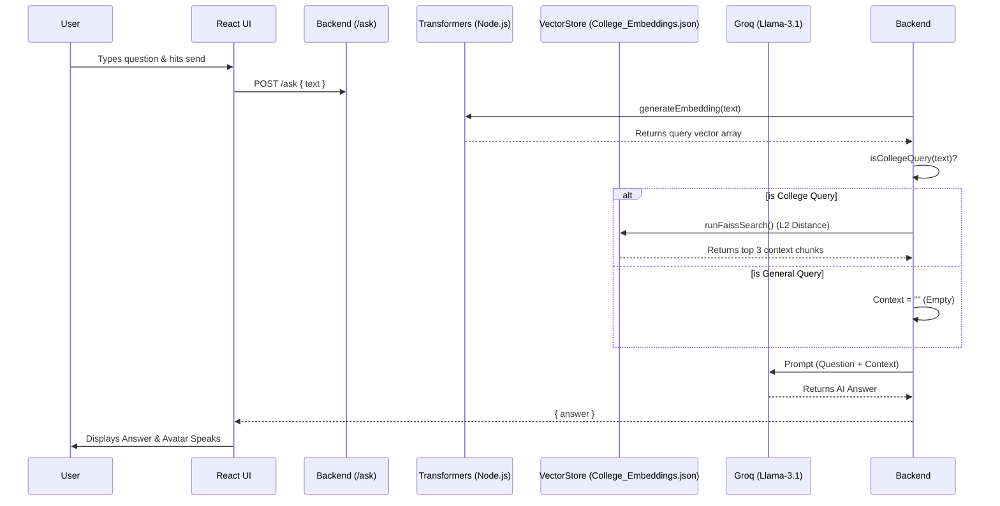
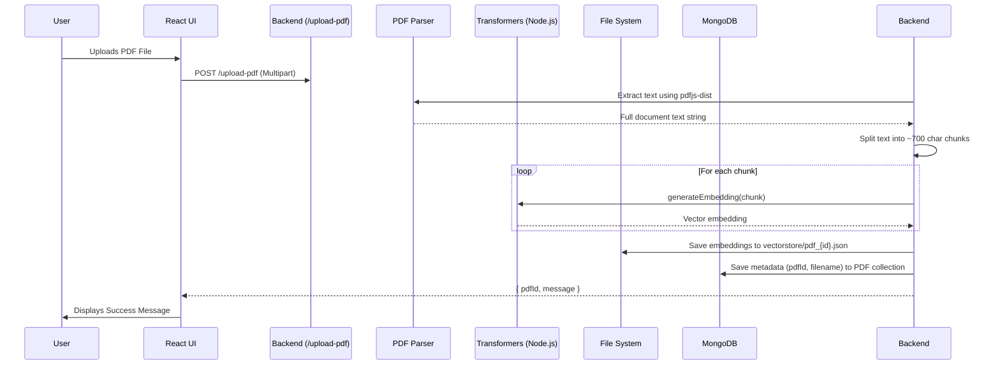
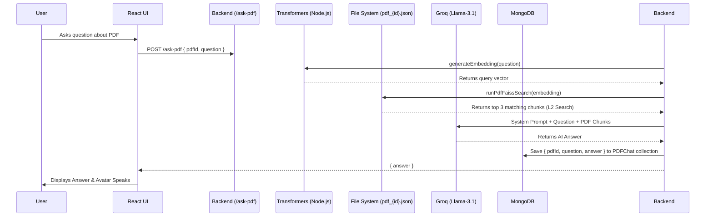

# AI_BOT: Architecture & Workflow Overview

## 1. System Overview

AI_BOT is a full-stack **Retrieval-Augmented Generation (RAG) Chatbot** featuring a 3D talking avatar. The system is designed to handle two main types of interactions:
1. **General & College Queries:** Answering questions based on a pre-embedded knowledge base about the college (SSIT) or general knowledge.
2. **PDF Context Queries:** Allowing users to upload PDF documents, extracting their text, creating vector embeddings, and answering questions strictly based on the uploaded document's context.

---

## 2. Technology Stack

### Frontend
- **React (via Vite):** Core UI framework for component-based architecture and state management.
- **Tailwind CSS:** Utility-first CSS framework for rapid UI styling (flexbox, grid, glassmorphism).
- **Three.js:** Renders the 3D visual avatar (`AvatarViewer.jsx`) which visually represents the bot to the user.
- **Google Cloud TTS (REST API):** Converts text responses into spoken audio using native `fetch` requests to Google's REST endpoint (bypassing unused npm packages).
- **Axios:** Handles HTTP requests to the backend API.

### Backend
- **Node.js & Express:** The core backend server runtime that exposes the REST API routes.
- **MongoDB & Mongoose:** NoSQL database used to persistently store metadata about uploaded PDFs (`PDF` schema) and full conversation histories (`PDFChat` schema).
- **@xenova/transformers:** Runs Hugging Face Machine Learning models directly inside Node.js. It uses the `all-MiniLM-L6-v2` model to convert text chunks into dense mathematical arrays (vector embeddings).
- **Native JS Vector Search:** Instead of relying on Python-based FAISS, the backend utilizes a native JavaScript L2 Euclidean distance calculator (`searchUtils.js`) to perform high-speed similarity searches on local JSON files.
- **pdfjs-dist & Multer:** `Multer` handles the multipart/form-data file upload stream, and `pdfjs-dist` scans the uploaded PDFs to extract raw text.
- **OpenAI Node.js SDK (Groq API):** The LLM integration (ironically named `getGeminiResponse` in the code) actually uses the OpenAI SDK to connect to **Groq**, leveraging the ultra-fast `llama-3.1-8b-instant` model to generate responses.


---

## 3. Architecture Flow Maps

### 3.1 High-Level System Architecture

```mermaid
graph TD
    subgraph Frontend [React Frontend]
        UI[User Interface]
        Avatar[3D Avatar - Three.js]
        TTS[Google TTS]
        API_Client[Axios API Client]
        
        UI --> API_Client
        API_Client --> UI
        UI --> TTS
        TTS --> Avatar
    end

    subgraph Backend [Express Node.js Backend]
        Router[Express Routes]
        Embeddings[@xenova/transformers]
        VectorSearch[Native L2 Distance Search]
        LLM[Groq Llama-3.1 API]
        PDF_Parser[pdfjs-dist]
        
        Router --> Embeddings
        Router --> PDF_Parser
        Router --> VectorSearch
        Router --> LLM
    end

    subgraph Storage [Data Storage]
        MongoDB[(MongoDB)]
        Local_JSON[(Local Vector JSON Files)]
    end

    API_Client <-->|HTTP/REST| Router
    Router <--> MongoDB
    VectorSearch <--> Local_JSON
    PDF_Parser --> Embeddings
    Embeddings --> Local_JSON
```

---

### 3.2 General / College Query Workflow

This workflow is triggered when a user asks a question without selecting an uploaded PDF.



---

### 3.3 PDF Upload Workflow

This workflow outlines what happens when a user uploads a new PDF to the system.



---

### 3.4 PDF Context Query Workflow

This workflow occurs when a user asks a question while a specific PDF document is active.



---

## 4. Key Architectural Highlights & Explanations

### 1. 100% JavaScript Implementation
Despite traces of python files (`search_faiss.py`), the actual deployed implementation completely bypasses Python. By utilizing `@xenova/transformers`, the Hugging Face models are loaded and run directly in the V8 engine within Node.js. 

### 2. Native Vector Search
Instead of using complex external vector databases (like Pinecone) or python libraries (like FAISS) which add deployment complexity, the backend relies on an elegantly simple local implementation. Embeddings are stored as local JSON files, and similarity is calculated on-the-fly using standard L2 (Euclidean) distance arrays within `searchUtils.js`. 

### 3. Groq Substituted for Gemini
While the backend's AI utility functions are named `getGeminiResponse`, the underlying implementation uses the OpenAI SDK connected to the **Groq API**. It specifically requests the `llama-3.1-8b-instant` model. This is a critical architectural choice designed to yield ultra-low latency response times, ensuring the 3D talking avatar feels conversational and real-time.

### 4. Stateful & Stateless Chat Separation
- **Stateless:** General and College queries do not automatically append to a specific chat database entity unless explicitly saved via the UI.
- **Stateful:** PDF-based chats are tightly coupled to the uploaded PDF ID (`pdfId`), and their interactions are automatically saved to MongoDB (`PDFChat`), allowing users to retrieve and resume specific document-based conversations via the `/chat-history/:pdfId` endpoint.
